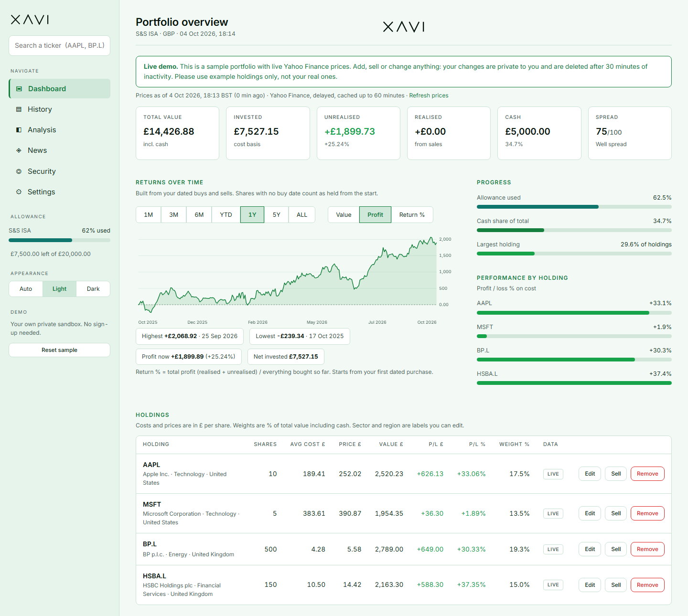
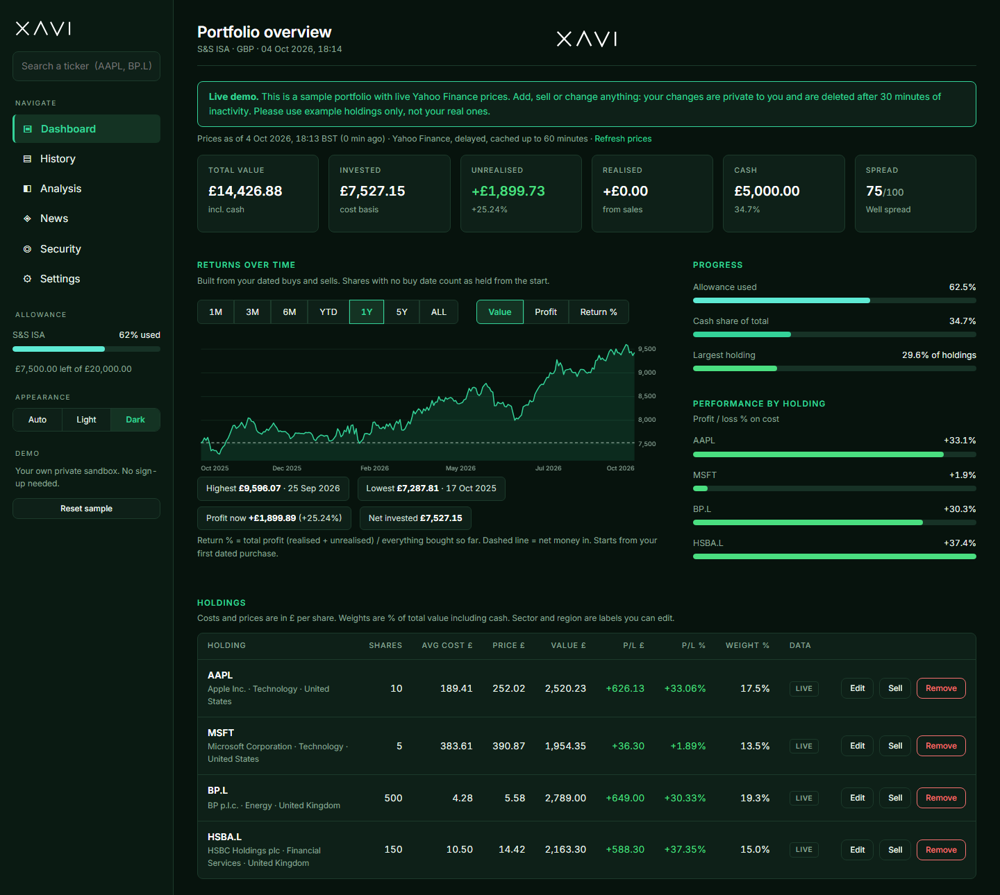
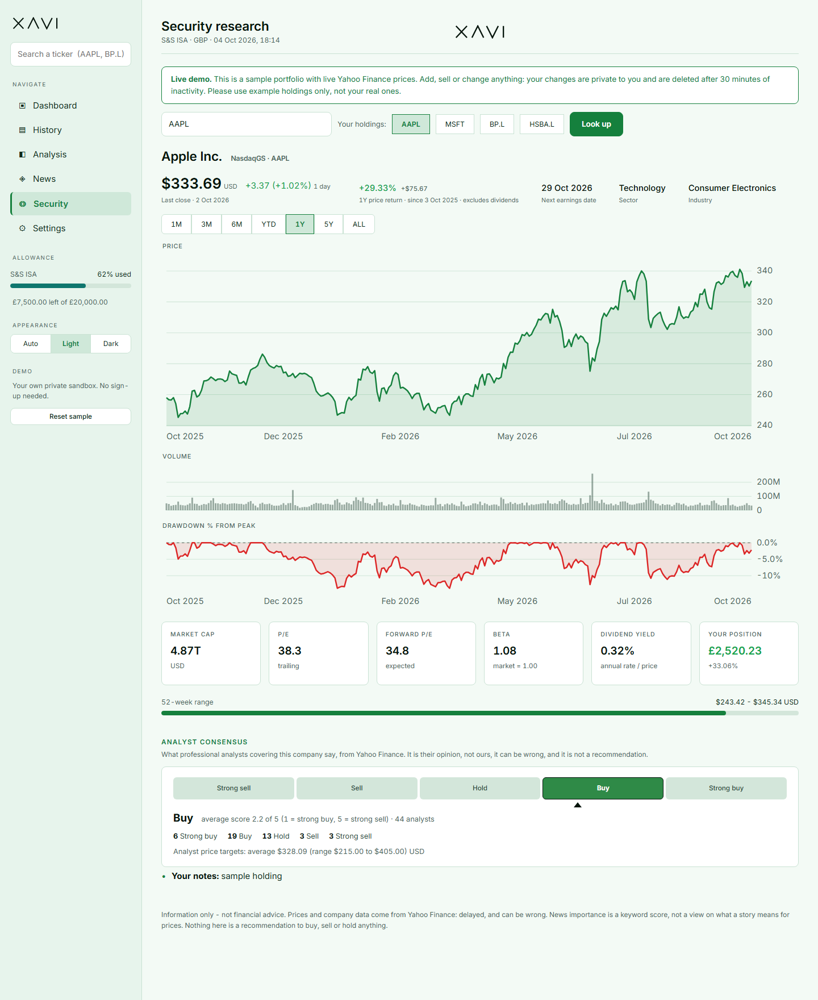
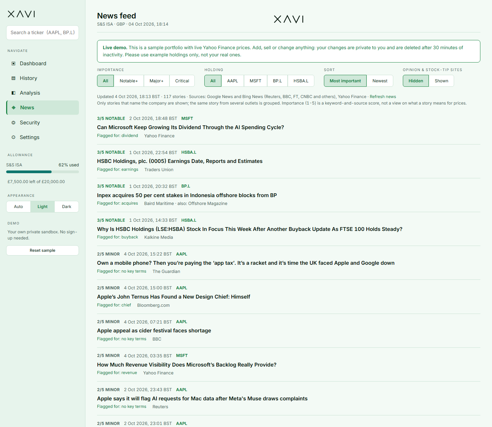

# XAVI - ISA Terminal

A personal portfolio dashboard: your holdings, how they're spread, and news about them.
Information only - it never tells you to buy, sell or hold anything.

## Try it live

**[xavi-demo.onrender.com](https://xavi-demo.onrender.com)** - no sign-up. You get a private sample
portfolio with live Yahoo Finance prices. Add, sell or edit anything and everything updates; your changes
are private and deleted after 30 minutes of inactivity (or press **Reset sample**).

- It runs on a free host, so the **first load can take up to a minute** while it wakes up.
- Please use example holdings only, not your real ones.
- Works on phones and tablets as well as desktop: on a small screen the sidebar becomes a Menu button with a
  bottom tab bar, tables turn into cards, and the charts redraw at phone width (touch a chart to see values).
- A few Yahoo fields (sector, beta, UK analyst ratings) can be blank online because Yahoo limits requests
  from cloud servers. The downloadable version below has the full data.

## Screenshots


*Dashboard: value, profit and return over time (built from your dated buys and sells), allowance and holdings.*


*Every page has light and dark mode.*


*Security research for any ticker: price return for the chosen range, key stats and the analyst consensus
(strong sell to strong buy). Analysts' views, not a recommendation.*


*News from several outlets, grouped by story and scored by importance. Only stories that name your company are shown.*

## Install it on your phone

Open the live demo in your phone's browser, then:

- **iPhone (Safari):** tap Share, then **Add to Home Screen**.
- **Android (Chrome):** tap **Install app** in the Menu (or Chrome's menu, then **Install app**).

It opens full-screen with the XAVI icon, like a normal app. It still needs an internet connection for live data.

## Download and run it yourself

Download this repository (green **Code** button, then **Download ZIP**, and unzip it). You need
[Python](https://www.python.org/downloads/) 3.10 or newer. Then:

| | Windows | Mac / Linux |
|---|---|---|
| **Web version** (the one running in the live demo) | double-click `start_web.bat` | `sh start_web.sh` |
| **Desktop dashboard** (Streamlit) | double-click `start_app.bat` | `sh start_app.sh` |
| **Terminal version** | `python run.py terminal` | `python3 run.py terminal` |

The first run sets itself up (about a minute, needs internet), then opens in your browser. It keeps a private
environment in `.venv`, so it never touches your other Python packages. Press Ctrl+C in the window to stop it.
Create an account (username + password); it starts completely empty. All versions share the same accounts and data,
and your portfolio stays on your own computer. (Mac/Linux scripts follow the standard approach but are less tested
than the Windows ones.)

You can also run it by hand: `python run.py web` (or `app`, `terminal`), add `--no-open` to skip opening the browser.

Optional settings for the web version (environment variables): `XAVI_DATA_DIR` (where accounts are stored),
`XAVI_PORT` (default 5000), `XAVI_NO_DEMO=1` (don't create the local `test` demo account), `XAVI_DEBUG=1`
(Flask debug mode), `XAVI_SECRET_KEY` (session key; otherwise one is generated and kept locally),
`FINNHUB_API_KEY` (optional extra source for analyst ratings).
The local `test` account is for local testing only. Do not expose the account version to the internet.

## Tests

The repository has an automated test suite (about 110 tests) that runs offline against a fake Yahoo, Nasdaq and news
feed, so it is fast and doesn't depend on the internet. GitHub runs it on every push on Python 3.10 to 3.13.

```
pip install -r requirements-dev.txt
python -m pytest
```

### Public demo (sandbox mode)

Set `XAVI_DEMO=1` and the app runs as a public try-it-out demo: no accounts and no sign-up.
Every visitor gets a private sandbox with a sample portfolio and live prices. They can add,
sell and edit holdings; changes are deleted after 30 minutes of inactivity
(`XAVI_SANDBOX_MINUTES`), or when they press **Reset sample**. At most 200 sandboxes exist at once
(`XAVI_MAX_SANDBOXES`), 25 holdings each, and ticker lookups are rate limited per connection.
Passwords, API keys and account deletion are switched off, and nothing is kept long term.

Deploy on Render: connect this repo and use the included `render.yaml` blueprint
(free plan; it sleeps when idle, so the first visit can take up to a minute).
The deploy sets `XAVI_HTTPS=1` (secure cookies) and `XAVI_BEHIND_PROXY=1` (correct visitor IPs).
Try it locally: `set XAVI_DEMO=1` then `python web/app.py`.

## Pages (web app)

Use the left sidebar. **Dashboard** (value, balance-over-time chart, allowance and
performance bars, holdings, add position), **Analysis** (spread score and exposure),
**News**, **Security** (price, volume and drawdown charts, key stats, earnings dates for
any holding), **Settings**. Type any ticker (for example AAPL or BP.L) into the sidebar
search box to open its Security page, even if you don't own it.

The balance chart shows what your *current* holdings would have been worth through time, not
your real past balance.

## Past results and returns (dates matter)

Give every buy and sale its real date and your returns chart is built from them:

- **Still holding:** enter the **date bought** when you add a position. (If you skip it, today's
  date is used, so the chart would start today.) Fix a date later: Web -> Dashboard ->
  *Transactions* -> edit the Date cell; Terminal -> Hist -> **(6) Change a date**, or Port ->
  Edit -> **(9) Set buy date**.
- **Already sold:** add a **closed trade** with its buy date, sell date, prices and fees. Web: the
  *Position* switch in the add form -> "Already sold". Terminal: Port -> **(4) Add closed trade**.
  It shows in your realised profit and returns but does **not** change your holdings or cash.
- **Returns over time** (Dashboard, web): range 1M to ALL, and a Value / Profit / Return % switch.
  Terminal: Hist tab, with a text chart ((4) switches what it shows, (5) the range).
  *Return % = total profit (realised + unrealised) / everything bought so far* (simple, not
  time-weighted). Shares you never gave a buy date count as held from the start.
- **Closed positions:** every sale with when it opened and closed, days held, cost, proceeds,
  profit and return %.

## Terminal app (`portfolio_tracker.py`)

Run `py -3.12 portfolio_tracker.py`. Tabs: **P** Port, **A** Anlz, **N** News, **S** Sect,
**H** Hist (transaction history), **T** Set. Type a tab's letter to switch; the numbers and
letters in the bottom menu are that tab's actions.

- **Add position:** three ways to enter it (shares + price, shares + total paid, amount + price),
  in £, pence or $, with fees and a date. Every buy is recorded in the transaction history.
- **Sell:** Port -> (3) Edit -> (7) Sell. Enter shares, price, fees and date, then choose **(A)**
  add the proceeds to cash or **(M)** update cash yourself. Sales use **FIFO** (oldest shares
  first), the holding's cost is recalculated on what's left, and a fully sold holding is removed
  (it stays in the history).
- **Realised and unrealised P&L:** both are shown on Port and Hist. Realised is the profit or loss
  on everything sold (after fees); unrealised is current value minus cost.
- **Hist tab:** every buy and sell (sort by date or ticker, filter by holding) plus a **cost
  basis check** that compares what the ledger says you paid with the cost held on each holding.
  "differs" means a holding was edited by hand or entered before the ledger existed.
- **CSV export:** press **E** on Port, Anlz, Sect or Hist. Files go to your Downloads folder
  (`xavi_holdings_YYYYMMDD.csv` and so on) and never overwrite an existing file.
- **Backup / restore:** Set -> **B** saves `xavi_backup_YYYYMMDD.json` (holdings, transactions,
  settings; API keys are never included). **R** restores from a file: the whole file is checked
  first, nothing changes if it's invalid, and a safety copy of your current data is saved before
  anything is replaced. Backups aren't encrypted: keep them somewhere safe.
- **Messages:** if Yahoo can't be reached you'll see "Prices unavailable. Showing cached data from
  2h ago. Press R to retry." Unknown tickers can be added without live data. Bad input says what
  was wrong and what you typed.

## Light and dark mode

The web app has a green theme in both modes (dark green and light green). Switch in the
three-dot menu at the top right -> Settings -> choose app theme (Light, Dark, or "Use system
setting"). Colours change instantly. The terminal app uses a green accent and follows your
terminal's own background.

## Make it yours

- **PORT -> Add position:** enter what you actually paid. Choose whichever you know:
  shares + price per share, shares + total paid, or amount invested + price per share.
  Prices can be in £, pence or US dollars, with fees and an optional date.
- **PORT -> Cash & allowance:** set your cash and how much of this year's allowance you've used.
- **SET tab:** display name, account label (S&S ISA, SIPP, GIA ...), yearly allowance, tax-year
  end date, timezone, optional news keys, change password, download your data, reset to zero.
- Sector and region are editable per holding in the holdings table.

## Accounts and privacy

- Passwords are never stored, only a salted scrypt hash. **There is no password recovery.**
  Forget it and the account can't be reopened.
- Each person's data lives in `users/<username>/`. The files are **not encrypted**: anyone who
  can open this folder can read them. Don't share the folder or run this on a shared machine.
- 5 wrong passwords lock the account for a minute.

## Data and limits

- Prices come from Yahoo Finance via `yfinance`: delayed, can be wrong, and for personal use
  only. Anything sold to the public needs a licensed data feed.
- News comes from Google News (Reuters, BBC, FT, CNBC and others) and Yahoo Finance, filtered to
  stories that name your companies. Importance (1-5) is a keyword-and-source score, not a view on
  what a story means for prices. SEC filings are optional (SET -> SEC contact email).
- Not financial advice. Nothing here is a recommendation.

## Files

| File | What it is |
|---|---|
| `web/` | The Flask web app: `app.py`, `xavi_charts.py`, `templates/`, `static/` (installable-app icons and service worker) |
| `app.py` | Desktop dashboard (Streamlit) |
| `portfolio_tracker.py` | Terminal dashboard |
| `isa_core.py` | Data, calculations, news (shared by all three) |
| `auth.py` | Accounts and passwords |
| `run.py` | Launcher that works on Windows, Mac and Linux (`python run.py web`) |
| `start_web.bat`, `start_app.bat`, `start_web.sh`, `start_app.sh` | Double-click / one-line starters that call `run.py` |
| `tests/` | Automated tests (offline) |
| `render.yaml` | One-click deploy settings for the free Render host |
| `requirements.txt`, `web/requirements.txt`, `requirements-dev.txt` | Packages for everything / the web app only / development and tests |

## Licence

MIT. See [LICENSE](LICENSE). XAVI is an information tool, not financial advice.
